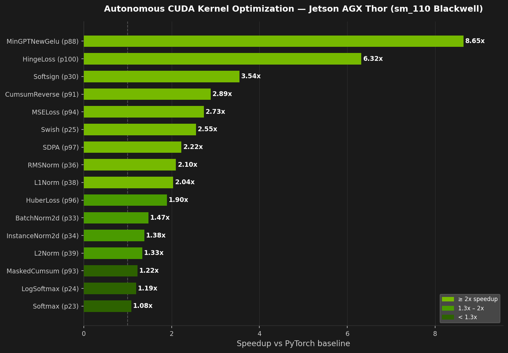

# KernelBench on NVIDIA Jetson AGX Thor (Blackwell)

**First KernelBench baseline, power characterization, and autonomous CUDA kernel optimization on a Jetson/Tegra SoC with Blackwell architecture (sm_110).**

**30 problems optimized. 28 beat or match PyTorch. Best: 8.6x (MinGPTNewGelu), 6.3x (HingeLoss), 2.9x (CumsumReverse).**

> **How it works:** All 30 CUDA kernels were written autonomously by [Claude Code](https://claude.ai/code) running an agentic optimization loop -- no human-written kernel code. Each iteration compiles on-device, checks correctness, benchmarks, and decides the next experiment. Inspired by [Sakana AI's autoresearch approach](https://github.com/SakanaAI/AI-Scientist).

| | |
|---|---|
| **Hardware** | NVIDIA Jetson AGX Thor -- Blackwell, sm_110, compute capability 11.0 |
| **Memory** | 125 GB unified (LPDDR5X, ATS -- shared CPU/GPU, no dedicated VRAM) |
| **Software** | PyTorch 2.9.1+cu130, CUDA 13.0, Python 3.12.3 |
| **Benchmark** | [KernelBench](https://github.com/ScalingIntelligence/KernelBench) v0.2.0 -- Level 1 (100 single-kernel operators) |
| **Precision** | fp32, cuda_event timing (5 warmup + 20 trials per problem) |
| **Kernels optimized** | 30 Level 1 problems, 28 beat or match baseline |

---

## Kernel Optimization Results



### Top Speedups

| PID | Name | Baseline | Best | Speedup | Technique |
|-----|------|----------|------|---------|-----------|
| 88 | MinGPTNewGelu | 19.8ms | 2.29ms | **8.646x** | 7-pass → 1-pass fusion, `__tanhf` |
| 100 | HingeLoss | 122.0ms | 19.3ms | **6.321x** | Fused reduce + target broadcast in L2 |
| 30 | Softsign | 197.0ms | 55.6ms | **3.543x** | 3-pass → 1-pass fusion, float4 |
| 91 | CumsumReverse | 110.0ms | 38.1ms | **2.887x** | Tiled R→L scan (avoids flip+cumsum+flip) |
| 94 | MSELoss | 103.0ms | 37.7ms | **2.732x** | Fused diff+square+reduce |
| 25 | Swish | 142.0ms | 55.6ms | **2.554x** | 2-pass → 1-pass, exact grid |
| 97 | SDPA | 143.0ms | 64.3ms | **2.224x** | TF32 Tensor Cores + baddbmm fusion |
| 36 | RMSNorm | 172.0ms | 82.0ms | **2.098x** | Register-cached single-pass, 512t |
| 38 | L1Norm | 193.0ms | 94.8ms | **2.036x** | Fused + L2-reuse between passes |
| 96 | HuberLoss | 69.0ms | 36.4ms | **1.896x** | Fused Huber+reduce |
| 33 | BatchNorm2d | 91.5ms | 62.2ms | **1.471x** | 1-block-per-channel fused |
| 34 | InstanceNorm2d | 135.0ms | 98.1ms | **1.376x** | Fused 2-pass L2-reuse, float4 |
| 39 | L2Norm | 118.0ms | 88.7ms | **1.330x** | Fused 2-pass, 4x float4 |
| 93 | MaskedCumsum | 90.5ms | 74.1ms | **1.221x** | Tile-based fwd scan fused with mask |
| 24 | LogSoftmax | 110.0ms | 92.1ms | **1.194x** | Online softmax + trivial pass-2 |
| 23 | Softmax | 100.0ms | 92.6ms | **1.080x** | Online softmax (SFU-bound on expf) |

Plus 13 elementwise activations (p19–p32) at 1.016–1.032x via float4 vectorization. See [reports/06](reports/06_activation_optimization.md) and [reports/07](reports/07_heavy_kernel_optimization.md) for full details. For analysis of which optimizations are Thor-specific vs universally portable, see [reports/08](reports/08_thor_vs_h100_transferability.md).

### Key Optimization Patterns

1. **Pass fusion** -- PyTorch's eager mode writes intermediate tensors to DRAM between ops. A single fused kernel eliminates these round-trips. Biggest wins: HingeLoss 6.3x, MSELoss 2.7x, Swish 2.6x.
2. **L2 cache reuse** -- Fused 2-pass kernels (statistics + normalize) keep data in L2 between passes. Works when working set < 32MB L2. Key for L1Norm (2.0x), InstanceNorm (1.4x).
3. **TF32 Tensor Cores** -- PyTorch SDPA ignores `allow_tf32`; raw `bmm` respects it. 3.6x faster GEMMs with < 5e-5 error after softmax.
4. **Tiled parallel scan** -- Reverse cumsum avoids PyTorch's flip+cumsum+flip (3 DRAM passes) with a direct R→L tiled scan (2.9x).
5. **Register caching** -- Small feature dimensions (C=64 for RMSNorm) fit entirely in thread registers for single-pass computation (2.1x).

### Dead Ends

- **Conv1D dilated/strided (p76)**: cuDNN already uses TF32 Tensor Cores. 6 approaches tried, all slower.
- **GroupNorm (p35)**: Working set (160MB) far exceeds L2. Both PyTorch and custom hit the same DRAM ceiling.
- **CumsumExclusive (p92)**: CUB prefix scan is near-optimal; custom kernels couldn't beat it.

---

## Baseline and Power Results

### Baseline Timing (Level 1 -- 100 problems)

| Mode | GPU Clock | Pass Rate | Median (ms) | Mean (ms) | Wall Time |
|------|-----------|-----------|-------------|-----------|-----------|
| **MAXN** | 1575 MHz | **99/100** | 51.5 | 59.0 | 920.9 s |
| **120W** | 1386 MHz | **99/100** | 54.9 | 61.6 | 948.6 s |

One failure in both modes: problem #95 (CrossEntropyLoss) -- `nll_loss` kernel not compiled for sm_110 in PyTorch 2.9.1+cu130. This is a PyTorch issue, not a Thor issue.

### Power Characterization (MAXN vs 120W)

| Metric | MAXN | 120W | Delta |
|--------|------|------|-------|
| GPU power (avg) | 22.1 W | 20.8 W | -5.7% |
| GPU temp (peak) | 66.6 C | 63.2 C | -3.4 C |
| Median latency | 51.5 ms | 54.9 ms | +6.6% |
| **Perf / Watt** | **4.88** | **5.02** | **+2.9%** |

**120W mode is 2.9% more efficient per watt** despite being 6.6% slower in median latency. Memory-bandwidth-bound operations (activations, reductions) are unaffected by the clock reduction; compute-bound operations (matmul, attention) slow 12-13%.

### Performance by Operator Category

| Category | n | MAXN median | 120W median | Slowdown | Bottleneck |
|----------|---|-------------|-------------|----------|------------|
| matmul | 18 | 23.1 ms | 26.0 ms | +12.6% | Compute |
| conv | 35 | 29.2 ms | 32.3 ms | +10.6% | Mixed |
| activation | 13 | 56.7 ms | 56.7 ms | 0.0% | Bandwidth |
| normalization | 8 | 112.5 ms | 115.0 ms | +2.2% | Bandwidth |
| pooling | 6 | 72.6 ms | 77.4 ms | +6.5% | Mixed |
| reduction | 11 | 65.0 ms | 64.7 ms | -0.5% | Bandwidth |
| softmax | 2 | 105.0 ms | 104.6 ms | -0.4% | Bandwidth |
| loss | 5 | 69.1 ms | 70.1 ms | +1.4% | Bandwidth |
| attention | 1 | 143.0 ms | 162.0 ms | +13.3% | Compute |

---

## Why This Matters

1. **First KernelBench results on Jetson/Blackwell.** No prior published baselines exist for sm_110 on a Tegra SoC. This data establishes the performance floor for kernel optimization on edge Blackwell hardware.

2. **Autonomous CUDA optimization works on edge hardware.** 30 problems optimized with custom CUDA kernels written by Claude Code in an autonomous loop. 10 problems exceed 1.3x speedup; 6 exceed 2x. The optimization patterns (pass fusion, L2 reuse, register caching) are specific to Thor's unified memory architecture.

3. **Unified memory changes the game.** Thor's ATS architecture eliminates OOMs and PCIe transfer overhead. L2 cache reuse between kernel passes is a key optimization lever that doesn't exist on discrete GPUs with separate device memory.

4. **Power efficiency is measurable.** The 120W mode's 2.9% efficiency gain with only 6.6% latency cost shows that for bandwidth-bound workloads, running at max clocks wastes power.

---

## Repository Structure

```
.
|-- README.md                           # This file
|-- LICENSE                             # MIT License
|-- program.md                          # Thor hardware facts + autoresearch protocol
|-- findings.md                         # Raw experiment log (all 30 problems)
|-- kernels/                            # Optimized CUDA kernels (30 .py files)
|   |-- p25_swish.py                    # Example: fused Swish, 2.554x
|   |-- p91_cumsumreverse.py            # Example: tiled R→L scan, 2.887x
|   |-- ...                             # 30 total kernel files
|-- reports/
|   |-- 00_thor_env_report.md           # Raw environment inventory
|   |-- 01_env_and_repo_audit.md        # Compatibility analysis
|   |-- 02_thor_compatibility_patches.md # Patches (pyproject.toml, cu130)
|   |-- 03_smoke_test.md                # CUDA + KernelBench smoke tests
|   |-- 04_baseline_pilot.md            # Full Level 1 baseline (99/100)
|   |-- 05_power_characterization.md    # MAXN vs 120W power analysis
|   |-- 06_activation_optimization.md   # 13 activation kernels optimized
|   |-- 07_heavy_kernel_optimization.md # 17 heavy kernels (norms, losses, scans, attention)
|   |-- 08_thor_vs_h100_transferability.md # Which optimizations transfer from H100 to Thor
|-- scripts/
|   |-- eval_kernel.py                  # Per-problem kernel eval (correctness + benchmark)
|   |-- eval_activations.py             # Batch eval across all activation kernels
|   |-- run_baseline_timing.py          # Baseline timing with timeout/OOM handling
|   |-- run_power_sweep.py              # Power mode sweep with tegrastats monitoring
|   |-- analyze_baseline.py             # Stats and per-category analysis
|   |-- compare_thor_h100.py            # Thor vs H100 baseline comparison
|   |-- analyze_transfer.py             # Sakana kernel transfer analysis
|-- templates/                          # CUDA kernel templates used by autoresearch loop
|-- results/
|   |-- Thor_AGX/
|       |-- baseline_level1.json        # MAXN baseline (99 problems)
|       |-- kernel_results.json         # All 30 optimized kernel results
|       |-- power_MAXN_level1_1-100.json  # MAXN with tegrastats
|       |-- power_120W_level1_1-100.json  # 120W with tegrastats
|       |-- sakana_transfer_level1.json # Sakana H100 kernel transfer results
```

---

## Reports

| # | Report | What it covers |
|---|--------|----------------|
| 00 | [Environment Inventory](reports/00_thor_env_report.md) | GPU, CUDA, Python, Docker baseline on Thor |
| 01 | [Compatibility Audit](reports/01_env_and_repo_audit.md) | KernelBench on aarch64/sm_110 -- risks and patches |
| 02 | [Patches Applied](reports/02_thor_compatibility_patches.md) | Two changes to run KernelBench on Thor |
| 03 | [Smoke Tests](reports/03_smoke_test.md) | End-to-end validation before full runs |
| 04 | [Baseline Pilot](reports/04_baseline_pilot.md) | Level 1 baseline -- 99/100 pass, per-category stats |
| 05 | [Power Characterization](reports/05_power_characterization.md) | MAXN vs 120W -- perf/watt tradeoffs |
| 06 | [Activation Optimization](reports/06_activation_optimization.md) | 13 activation kernels -- float4, pass fusion, intrinsics |
| 07 | [Heavy Kernel Optimization](reports/07_heavy_kernel_optimization.md) | 17 kernels -- norms, losses, scans, attention, conv |
| 08 | [Thor vs H100 Transferability](reports/08_thor_vs_h100_transferability.md) | Which H100 optimizations survive on unified memory |

---

## How to Reproduce

### Prerequisites

- NVIDIA Jetson AGX Thor (or any Blackwell GPU with CUDA 13.0+)
- Python 3.10+ with venv

### Setup

```bash
# 1. Create isolated environment
python3 -m venv venv
source venv/bin/activate

# 2. Install PyTorch with sm_110 support (cu130 required for Blackwell)
pip install 'torch==2.9.1' --index-url https://download.pytorch.org/whl/cu130

# 3. Install KernelBench (with relaxed Python pin)
git clone https://github.com/ScalingIntelligence/KernelBench.git
# Edit KernelBench/pyproject.toml: change requires-python = "==3.10.*" to ">=3.10"
pip install -e KernelBench --no-deps
pip install numpy tqdm packaging ninja tomli einops python-dotenv \
  pydra-config tabulate datasets transformers openai litellm

# 4. Add CUDA to PATH
export PATH=$PATH:/usr/local/cuda-13.0/bin
```

### Run baseline timing

```bash
# Single problem smoke test
python scripts/run_baseline_timing.py 1 1 1  # Level 1, problem 1 only

# Full Level 1 baseline (100 problems, ~15 min)
python scripts/run_baseline_timing.py 1 1 100

# Analyze results
python scripts/analyze_baseline.py results/Thor_AGX/baseline_level1.json
```

### Run power sweep

```bash
# Requires sudo for nvpmodel/jetson_clocks
python scripts/run_power_sweep.py 0  # MAXN mode, full Level 1
python scripts/run_power_sweep.py 1  # 120W mode, full Level 1
# Modes 2 (90W) and 3 (70W) require a reboot -- see reports/05_power_characterization.md
```

---

## Thor-Specific Observations

**Unified Memory (ATS)**
- No OOMs: GPU shares the full 125 GB system pool. All 100 problems run without memory issues.
- No PCIe jitter: data is not copied between host and device. Timing variance is exceptionally low.
- Lower bandwidth than HBM: memory-bound kernels (activations, normalization) are slower relative to compute-bound ones compared to discrete GPUs.

**Blackwell sm_110 on PyTorch 2.9.1+cu130**
- 99/100 Level 1 kernels work. The one failure (CrossEntropyLoss `nll_loss`) is a missing kernel dispatch, not an architecture limitation.
- The cu126 wheel does NOT support sm_110 -- cu130 is required.
- No aarch64-specific code changes were needed in KernelBench itself.

**Power Modes**
- MAXN and 120W switch without reboot (same GPU power-gating mask).
- 90W and 70W require a reboot (different GPU partition configuration).
- `jetson_clocks` locks frequencies at the mode's maximum for stable benchmarking.

---

## Compatibility Patches

Only two changes were needed to run KernelBench on Thor:

1. **`pyproject.toml`**: `requires-python = "==3.10.*"` changed to `">=3.10"` (Thor ships Python 3.12.3; no 3.10-specific syntax in codebase).
2. **PyTorch wheel**: must use `cu130` index (not `cu126`) to get sm_110 compiled kernels.

See [`reports/02_thor_compatibility_patches.md`](reports/02_thor_compatibility_patches.md) for full details.

---

## Roadmap

- [x] **Level 1 baseline** -- 99/100 problems baselined on Thor AGX
- [x] **Power characterization** -- MAXN vs 120W comparison
- [x] **Sakana kernel transfer study** -- 63 H100 kernels evaluated on Thor (32 compiled, 23 faster)
- [x] **Autonomous kernel optimization** -- 30 problems optimized, 28 beat or match baseline
- [ ] **Level 2 & 3 baselines** -- Operator fusion (100 problems) and full architectures (50 problems)
- [ ] **torch.compile baselines** -- Compare eager vs Inductor-compiled performance
- [ ] **Publish findings** -- Blog post: "Autonomous CUDA Kernel Optimization on Edge Blackwell" *(coming soon)*

---

## Acknowledgments

- [KernelBench](https://github.com/ScalingIntelligence/KernelBench) by the Scaling Intelligence team at Stanford
- NVIDIA for the Jetson AGX Thor developer kit

---

## License

[MIT](LICENSE)
