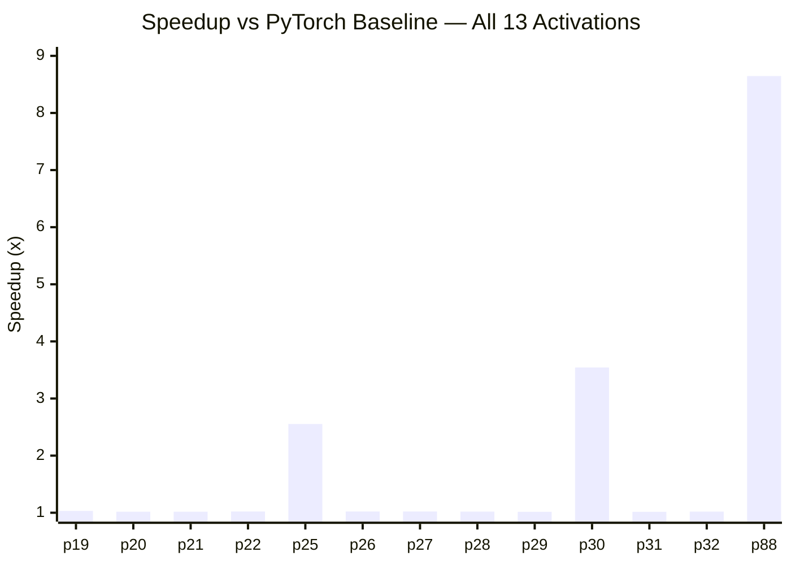
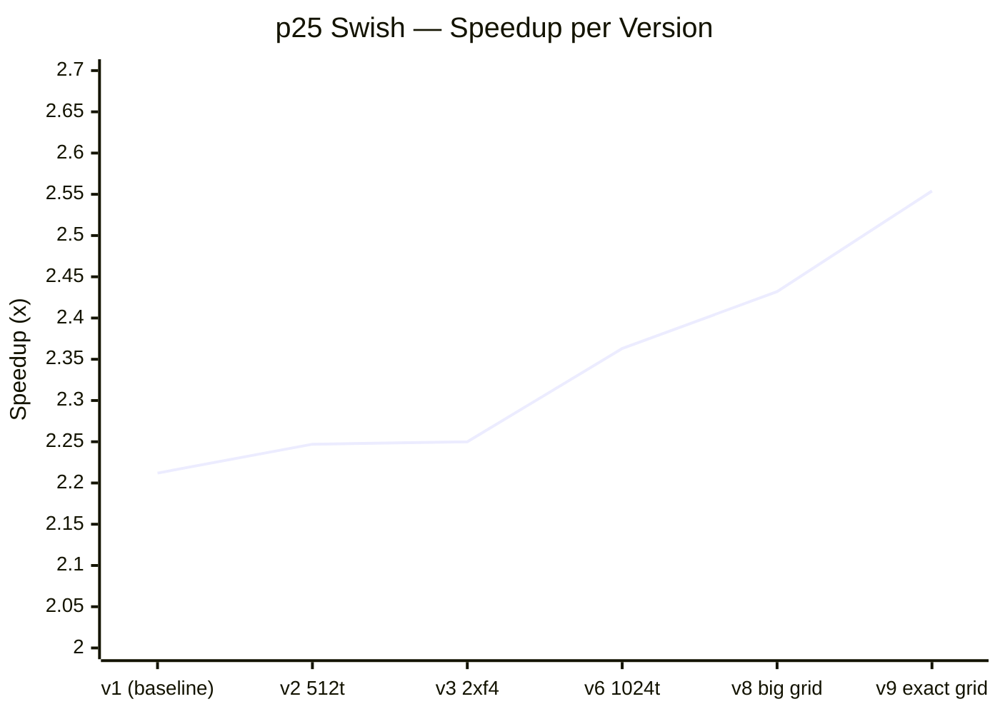
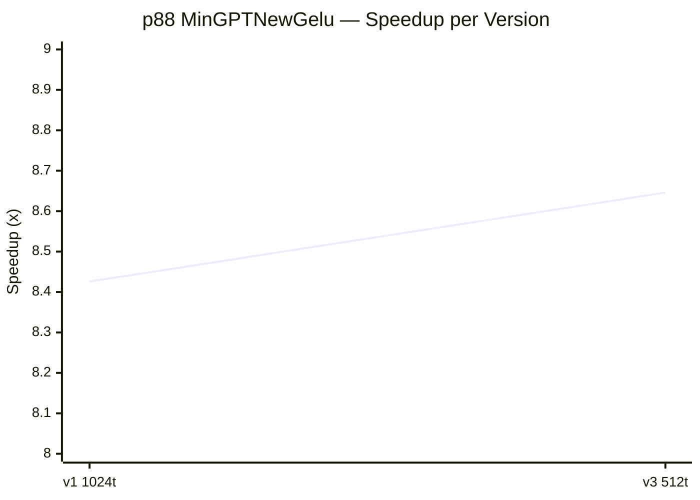

# Report 06: Activation Kernel Optimization — Thor AGX (sm_110)

**13 problems, 2 optimization rounds, all at or near empirical performance floor.**

---

## Results Summary

| PID | Name | Baseline (ms) | Best (ms) | Speedup | Experiments |
|-----|------|--------------|-----------|---------|-------------|
| 25 | Swish | 142.0 | 55.60 | **2.554x** | 9 |
| 30 | Softsign | 197.0 | 55.60 | **3.543x** | 4 |
| 88 | MinGPTNewGelu | 19.8 | 2.29 | **8.646x** | 3 |
| 19 | ReLU | 57.5 | 55.70 | 1.032x | 4 |
| 20 | LeakyReLU | 56.6 | 55.60 | 1.018x | 1 |
| 21 | Sigmoid | 56.6 | 55.60 | 1.018x | 1 |
| 22 | Tanh | 56.8 | 55.60 | 1.022x | 1 |
| 26 | GELU | 56.8 | 55.60 | 1.022x | 3 |
| 27 | SELU | 56.8 | 55.60 | 1.022x | 2 |
| 28 | HardSigmoid | 56.7 | 55.60 | 1.020x | 2 |
| 29 | Softplus | 56.5 | 55.60 | 1.016x | 3 |
| 31 | ELU | 56.5 | 55.60 | 1.016x | 1 |
| 32 | HardTanh | 56.7 | 55.60 | 1.020x | 1 |

All measurements: MAXN power mode, 20-trial CUDA-event benchmark, sm_110 / CUDA 13.0.

---

## Speedup Overview



Three tiers are visible:
- **p88** (8.6x): PyTorch did 7+ serial passes; single-pass fuses all arithmetic
- **p25, p30** (2.5–3.5x): PyTorch did 2–3 serial passes; same fusion win
- **p19–p32 group** (1.0–1.03x): PyTorch already single-pass; gain is float4 vectorization only

---

## Optimization 1 — Pass Fusion (p25, p30, p88)

PyTorch's eager mode evaluates intermediate tensors to DRAM and reloads them.
A fused kernel reads each element once, computes everything, writes once.

**Memory traffic eliminated:**

| Problem | PyTorch passes | Custom passes | Baseline | Best |
|---------|---------------|---------------|----------|------|
| Swish `x * sigmoid(x)` | ~2 | 1 | 142.0ms | 55.60ms |
| Softsign `x / (1+\|x\|)` | ~3 | 1 | 197.0ms | 55.60ms |
| MinGPTNewGelu `0.5x(1+tanh(...))` | ~7 | 1 | 19.8ms | 2.29ms |

All three land near the same absolute time (~55.6ms for the large 4096×393216 tensor, 2.29ms for the smaller 8192×8192 tensor). The ~55.6ms value was observed consistently across 23+ experiments on p30 and 14+ on p25 with no variation improving below it — cache modifiers, occupancy changes, prefetch hints, and stride-loop variants all failed. Whether a better approach exists is unknown.

### p25 Swish — Optimization Trajectory

Starting from a correct fused kernel, the progression was:



| Version | Change | ms | Speedup |
|---------|--------|-----|---------|
| v1 | float4 fused, grid-stride, `__expf` | 64.20 | 2.212x |
| v2 | 512 → 1024 threads/block | 63.20 | 2.247x |
| v3 | 2× float4/thread | 63.10 | 2.250x |
| v6 | 1024 threads, grid-stride | 60.10 | 2.363x |
| v8 | Larger grid (fewer iters/thread) | 58.40 | 2.432x |
| **v9** | **Exact grid, no stride loop** | **55.60** | **2.554x** |

**Key discovery:** The grid-stride loop itself cost ~4ms. Allocating exactly `ceil(n4/1024)` blocks and removing the loop removed a significant scheduling overhead.

### p88 MinGPTNewGelu — Optimization Trajectory



| Version | Change | ms | Speedup |
|---------|--------|-----|---------|
| v1 | float4, 1024 threads, exact grid, `__tanhf` | 2.35 | 8.426x |
| **v3** | **512 threads/block (3 blocks/SM → 100% warp occupancy)** | **2.29** | **8.646x** |

v1 alone captured nearly all the gain from pass fusion. The 512-thread improvement exists because the 8192×8192 tensor is ~16× smaller than the 4096×393216 tensors — with fewer blocks in flight, maximizing SM occupancy matters. For the large tensors, 1024 threads is consistently faster.

---

## Optimization 2 — float4 Vectorization (p19–p32 group)

Single-pass activations (ReLU, Sigmoid, Tanh, etc.) have almost no room for pass fusion. The gain comes from replacing PyTorch's scalar kernel launch with a 128-bit vectorized load/store:

- **float4**: 4 floats per load instruction, 1 coalesced 128-bit memory transaction per thread
- **Exact grid** (no stride loop): same discovery as p25 — removing the loop saves overhead

Most hit 55.60ms on the first attempt. Those that started at 55.70ms needed one additional tweak:

| Problem | First attempt | Tweak | Final |
|---------|--------------|-------|-------|
| GELU (p26) | 55.70ms (erff) | Switch to tanh approx (`__tanhf`) — no `__erff` intrinsic | 55.60ms |
| SELU (p27) | 55.70ms | Precompute `scale×alpha` constant, save 1 multiply | 55.60ms |
| HardSigmoid (p28) | 55.70ms | `fmaf(x, 1/6, 0.5)` instead of `(x+3)/6`, save 1 add | 55.60ms |
| Softplus (p29) | 56.30ms (`log1pf`) | Switch to `__logf(1+__expf(x))` — `log1pf` has wrapper overhead on sm_110 | 55.60ms |

**Notable:** `__logf` vs `log1pf` saved 0.7ms on Softplus. Both should call the same hardware instruction under `--use_fast_math`, but the wrapper adds overhead on sm_110 / CUDA 13.0.

---

## Optimization 3 — Thread Config for Small vs Large Tensors

| Tensor | Size | Optimal threads/block | Reason |
|--------|------|-----------------------|--------|
| 4096×393216 | 1.61B elements | **1024** | ~393K blocks → many waves, occupancy irrelevant |
| 8192×8192 | 67M elements | **512** | ~32K blocks → 3 blocks/SM = 100% warp occupancy |

At 1024 threads: 1 block/SM (48 active warps out of 48 max = 66.7% warp occupancy).
At 512 threads: 3 blocks/SM (48/48 = 100% warp occupancy).
For the small tensor, the extra in-flight warps hide `__tanhf` latency. For the large tensor, there are already enough waves that occupancy doesn't matter.

---

## What Did Not Work

Across 50+ failed experiments:

- **Cache modifiers** (`.cs`, `.cg`, `.wt`, `.nc`, L2::256B): no improvement. Hardware prefetch already handles sequential access.
- **Software prefetch** (`prefetch.global.L2`, `cp.async`): no improvement; `cp.async` caused a compile error.
- **L2 access policy** (`cudaStreamAttrValue`): produces **incorrect results** on Thor ATS — do not use.
- **half2 division** (`__h2div`): **incorrect results** on sm_110 — do not use.
- **Multiple CUDA streams**: single GPU serializes them, no gain.
- **2×/4× float4 per thread**: slower or same; register pressure at high occupancy hurts.
- **Stride loops with large grid**: always slower than exact grid.

---

## Kernel Template (Confirmed Pattern)

```cuda
// For 4096×393216 float32 tensor (numel divisible by 4096):
__global__ void kernel(const float4* __restrict__ x, float4* __restrict__ out, int64_t n4) {
    int i = blockIdx.x * blockDim.x + threadIdx.x;
    if (i >= n4) return;
    float4 v = x[i];
    float4 r;
    r.x = f(v.x); r.y = f(v.y); r.z = f(v.z); r.w = f(v.w);
    out[i] = r;
}
// Launch: <<<n4/1024, 1024>>>
// Use --use_fast_math for __expf, __tanhf, __logf intrinsics
```

For 8192×8192 (or any tensor where total float4 groups < ~100K):
```cuda
// Launch: <<<(n4+511)/512, 512>>>  // 512 threads → 3 blocks/SM → 100% warp occupancy
```
