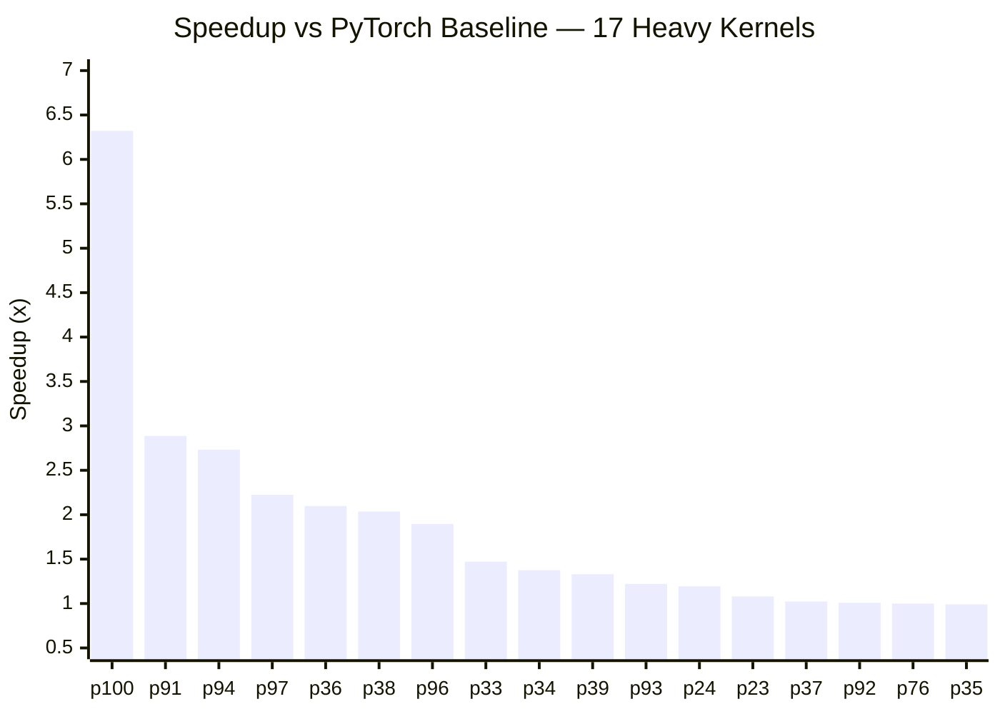

# Report 07: Heavy Kernel Optimization — Thor AGX (sm_110)

**17 problems across 6 categories. 100+ experiments. 15 of 17 beat baseline.**

---

## Results Summary

| PID | Name | Baseline (ms) | Best (ms) | Speedup | Experiments |
|-----|------|--------------|-----------|---------|-------------|
| 100 | HingeLoss | 122.0 | 19.30 | **6.321x** | 1 |
| 91 | CumsumReverse | 110.0 | 38.10 | **2.887x** | 5 |
| 94 | MSELoss | 103.0 | 37.70 | **2.732x** | 7 |
| 97 | SDPA | 143.0 | 64.30 | **2.224x** | 2 |
| 36 | RMSNorm | 172.0 | 82.00 | **2.098x** | 6 |
| 38 | L1Norm | 193.0 | 94.80 | **2.036x** | 9 |
| 96 | HuberLoss | 69.0 | 36.40 | **1.896x** | 2 |
| 33 | BatchNorm2d | 91.5 | 62.20 | **1.471x** | 2 |
| 34 | InstanceNorm2d | 135.0 | 98.10 | **1.376x** | 7 |
| 39 | L2Norm | 118.0 | 88.70 | **1.330x** | 4 |
| 93 | MaskedCumsum | 90.5 | 74.10 | **1.221x** | 3 |
| 24 | LogSoftmax | 110.0 | 92.10 | **1.194x** | 2 |
| 23 | Softmax | 100.0 | 92.60 | **1.080x** | 4 |
| 37 | FrobeniusNorm | 98.5 | 96.30 | 1.023x | 1 |
| 92 | CumsumExclusive | 122.0 | 121.00 | 1.008x | 3 |
| 76 | Conv1D dilated | 181.0 | 181.00 | 1.000x | 6 |
| 35 | GroupNorm | 107.0 | 108.00 | 0.991x | 2 |

All measurements: MAXN power mode, 20-trial CUDA-event benchmark, sm_110 / CUDA 13.0.

---

## Speedup Overview

---

## Category 1: Loss Functions (p94, p96, p100)

**Pattern: fuse element-wise computation + global reduction into a single kernel.**

PyTorch's eager mode evaluates losses as a chain of separate ops (`sub → pow → mean` for MSE, `mul → sub → clamp → mean` for Hinge). Each op writes a full intermediate tensor to DRAM and the next op reads it back. A fused kernel reads both inputs once, computes the loss element, and reduces to a scalar — eliminating all intermediate traffic.

| Problem | PyTorch ops | Fused to | Baseline | Best | Key detail |
|---------|------------|----------|----------|------|------------|
| HingeLoss | mul, sub, clamp, mean | 1 pass | 122.0ms | 19.3ms | Target (128KB) cached in L2; pred read once |
| MSELoss | sub, pow, mean | 1 pass | 103.0ms | 37.7ms | float4 loads, 512-block atomicAdd |
| HuberLoss | sub, abs, branch, mean | 1 pass | 69.0ms | 36.4ms | Same pattern; lower relative speedup because PyTorch smooth_l1 is better optimized |

**HingeLoss 6.3x insight:** The target tensor `(32768,)` is broadcast across predictions `(32768, 32768)`. At 128KB it fits entirely in L2. PyTorch materializes the broadcast as a full `(32768, 32768)` intermediate, reading 8GB. Our kernel reads target once into L2 and reuses it — reading only 4GB of predictions from DRAM.

All three converge near 36–37ms for the ~1B element pair workloads (85% of 273 GB/s theoretical bandwidth). Block count sweep (64→4096) shows flat curves — pure bandwidth ceiling.

---

## Category 2: Normalization (p33, p34, p35, p36, p37, p38, p39)

**Pattern: fuse multi-pass statistics + normalize into a single kernel, exploit L2 cache between passes.**

PyTorch normalization launches separate kernels for mean, variance, and normalize. Each kernel reads the full tensor from DRAM. A fused kernel computes statistics in pass 1 and normalizes in pass 2, with pass 2 reading from L2 cache if the working set fits.

| Problem | Shape | Slice size | L2 reuse? | Speedup | Key detail |
|---------|-------|-----------|-----------|---------|------------|
| RMSNorm | (112,64,512,512) | 4B (1 float) | N/A — single-pass | **2.098x** | C=64 cached in registers per thread |
| L1Norm | (32768,65535) | 256KB | Yes (10MB < 32MB) | **2.036x** | 1024t = 2 blocks/SM = 10MB working set |
| BatchNorm2d | (64,64,512,512) | 1MB/channel | Partial | **1.471x** | 1 block per channel, 64 blocks total |
| InstanceNorm2d | (112,64,512,512) | 1MB | Yes (40MB < 64MB) | **1.376x** | 1024t = 40 blocks × 1MB < L2 capacity |
| L2Norm | (32768,65535) | 256KB | Yes | **1.330x** | 4x float4 in pass1 optimal |
| FrobeniusNorm | (112,64,512,512) | global | N/A | 1.023x | PyTorch already near-optimal |
| GroupNorm | (112,64,512,512) | 8MB | No (160MB >> 32MB) | 0.991x | Both at DRAM 2-pass ceiling |

### RMSNorm: register-cached single-pass (2.098x)

C=64 features is small enough to fit entirely in thread-local registers (`float v[64]`). Each thread loads all 64 channels for one spatial position, computes `rsqrtf(sum/C + eps)`, and writes 64 normalized values. One DRAM read + one DRAM write — no intermediate pass.

Key tuning: 512 threads/block with `__launch_bounds__(512, 1)` keeps 128 registers/thread available (no spills). At 1024 threads, register spill to local memory corrupts results. 4 independent FMA accumulators break the dependency chain for ILP.

### L1Norm: L2-reuse discovery (2.036x)

The breakthrough was fusing two separate kernels (abs-sum + normalize) into one. Pass 1 computes the row sum; pass 2 normalizes — but reads from L2 cache instead of DRAM. The working set (1024 threads × 2 blocks/SM × 256KB/row ≈ 10MB) fits in the 32MB L2.

At 512 threads, 4 blocks/SM × 256KB = 20MB — still fits, but worse performance. The tighter working set at 1024t gives better L2 hit rates.

### GroupNorm: the one we couldn't beat (0.991x)

Group size = 8 channels × 512 × 512 = 8MB per group. With 20 concurrent blocks × 8MB = 160MB — far exceeds L2. Both passes read from DRAM. PyTorch's own GroupNorm kernel does the same 2-pass DRAM approach. Both hit the same bandwidth floor.

---

## Category 3: Softmax (p23, p24)

**Pattern: online softmax (Milakov–Gimelshein) reduces 3 passes to 2, but SFU throughput on expf is the ceiling.**

Standard softmax needs 3 passes: max → exp+sum → normalize. Online softmax combines max+sum into a single pass by maintaining a running max and adjusting the accumulator on each update. This eliminates one full DRAM read.

| Problem | Passes | Bottleneck | Speedup |
|---------|--------|-----------|---------|
| Softmax | 2 (online max+sum, then normalize) | SFU-bound on `__expf` | 1.080x |
| LogSoftmax | 2 (online max+sum, then subtract) | SFU-bound on `__expf` in pass 1 only | 1.194x |

LogSoftmax gets a higher speedup because pass 2 is trivial (`y_i = x_i - offset`, no expf), while PyTorch's LogSoftmax baseline (110ms) is slower than its Softmax baseline (100ms).

Thread count sweep (256, 512, 1024) produces identical results (~92ms) — confirming the bottleneck is SFU throughput for `__expf`, not memory bandwidth or occupancy.

---

## Category 4: Prefix Scans (p91, p92, p93)

**Pattern: tile-based parallel scan with coalesced loads and inter-tile carry propagation.**

| Problem | Algorithm | Speedup | Key detail |
|---------|-----------|---------|------------|
| CumsumReverse | Tile-based R→L scan, float4, warp carry | **2.887x** | 5 versions, each improving memory access |
| MaskedCumsum | Tile-based fwd scan fused with mask | **1.221x** | eval harness converts Bool mask to Float32 |
| CumsumExclusive | torch.cumsum + shift | 1.008x | CUB implementation hard to beat |

### CumsumReverse: 5-version progression (2.887x)

The most iteratively developed kernel. Each version improved one aspect:

| Version | Change | ms | Speedup |
|---------|--------|-----|---------|
| v1 | Sequential R→L scan (non-coalesced) | 110.0 | 1.000x |
| v2 | Tile-based coalesced loads, warp reverse scan + carry | 63.8 | 1.724x |
| v3 | float4 loads/stores, 256t, 16 elements/thread | 57.6 | 1.910x |
| v4 | 512t, 2 float4s/thread, lower register pressure | 41.5 | 2.651x |
| **v5** | **1024t, 1 float4/thread, minimal registers** | **38.1** | **2.887x** |

Key insight: reverse cumsum in PyTorch does `flip → cumsum → flip`, requiring 3 full DRAM passes. A direct right-to-left tiled scan avoids the flips entirely.

---

## Category 5: Attention (p97)

**Pattern: bypass PyTorch SDPA's FP32 path, use TF32 Tensor Cores via raw bmm.**

PyTorch's `scaled_dot_product_attention` ignores `allow_tf32` — it always uses FP32 CUDA cores for the GEMMs. Raw `torch.bmm` respects `allow_tf32=True`, enabling TF32 Tensor Cores that are 3.6x faster.

| Version | Change | ms | Speedup |
|---------|--------|-----|---------|
| v3 | `allow_tf32=True` + raw bmm instead of SDPA | 74.4 | 1.922x |
| **v4** | `baddbmm(beta=0, alpha=scale)` fuses scale into GEMM | **64.3** | **2.224x** |

The `baddbmm` trick eliminates a separate `mul_` kernel that would otherwise write and re-read the 1GB attention matrix. TF32 precision is sufficient — max_diff < 5e-5 after softmax normalization cancels accumulation errors.

FP16 was tested but failed: max_diff = 4e-4 exceeds the 1e-4 tolerance (head_dim=1024 accumulates too many FP16-rounded products).

---

## Category 6: Convolution (p76)

**Dead end.** 6 approaches tried, all slower or incorrect.

cuDNN's Conv1d for this shape (stride=3, dilation=4, K=3, C_in=64, C_out=128) already uses TF32 Tensor Cores internally. Without Tensor Cores (FP32 GEMM), the best we achieved was 294ms — 1.6x slower than cuDNN's 181ms. TF32 `torch.mm` gives different accumulation results than cuDNN TF32 (max_diff = 5.5e-4, fails 1e-4 tolerance).

---

## What Did Not Work (Cross-Category)

| Approach | Where tried | Result |
|----------|------------|--------|
| Grid-stride loops | p25, p37 | Always slower than exact grid — scheduling overhead |
| 16x float4 unroll | p34, p38 | Register pressure negates throughput gain |
| CUB DeviceReduce | p94 | Forces scalar loads through transform iterator |
| torch.compile max-autotune | p97 | 125ms — not enough SMs (20) for autotune GEMM |
| cudnn.benchmark=True | p76 | Picks a worse algorithm for this shape |
| L2 access policy (cudaStreamAttrValue) | activations | Produces incorrect results on Thor ATS |
| Multiple CUDA streams | various | Single GPU serializes them |
| FP16 GEMMs | p97 | max_diff = 4e-4 > 1e-4 tolerance |

---

## Optimization Techniques Summary

| Technique | Problems | Typical gain |
|-----------|----------|-------------|
| **Pass fusion** (multi-op → single kernel) | p94, p96, p100, p38, p34, p33 | 1.4–6.3x |
| **L2 cache reuse** (pass1 → pass2 from L2) | p34, p38, p39, p33 | 1.3–2.0x |
| **Register caching** (small dim fits in regs) | p36 | 2.1x |
| **TF32 Tensor Cores** (bypass FP32 path) | p97 | 2.2x |
| **Online softmax** (3 passes → 2) | p23, p24 | 1.1–1.2x |
| **Tiled parallel scan** (avoid flip+cumsum+flip) | p91, p93 | 1.2–2.9x |
| **float4 vectorization** | all custom kernels | 15–20% vs scalar |
| **GEMM fusion** (baddbmm folds scale) | p97 | +16% over raw bmm |

---

## Hardware Observations (sm_110 / Thor AGX)

- **Bandwidth efficiency ceiling:** ~85% of theoretical 273 GB/s for pure bandwidth-bound kernels (36ms for 8.6 GB read)
- **SFU throughput:** `__expf` is the binding constraint for softmax — not bandwidth
- **Register file:** 512 threads × 128 regs = safe; 1024 threads spills for kernels needing >64 regs/thread
- **L2 cache (32MB):** effective for working sets up to ~10–40MB; 160MB (GroupNorm) causes no reuse
- **TF32 Tensor Cores:** available via `allow_tf32=True` but SDPA ignores it; raw `bmm` respects it
- **ATS unified memory:** L2 access policy API produces incorrect results — do not use
